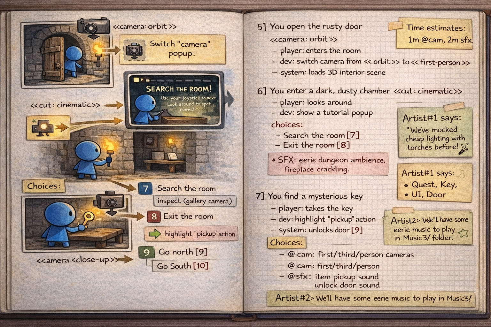
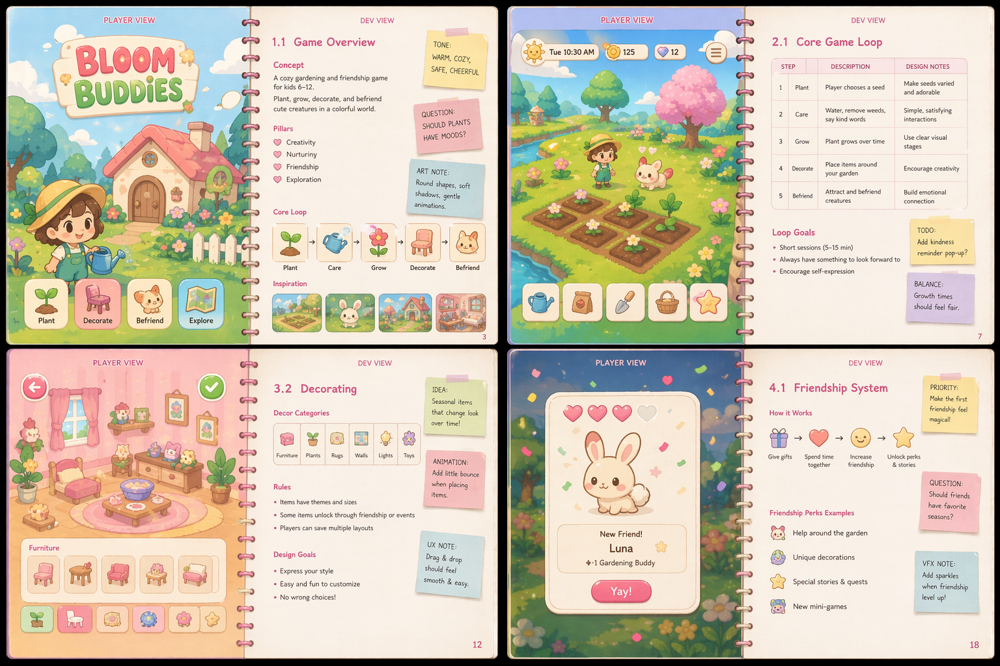
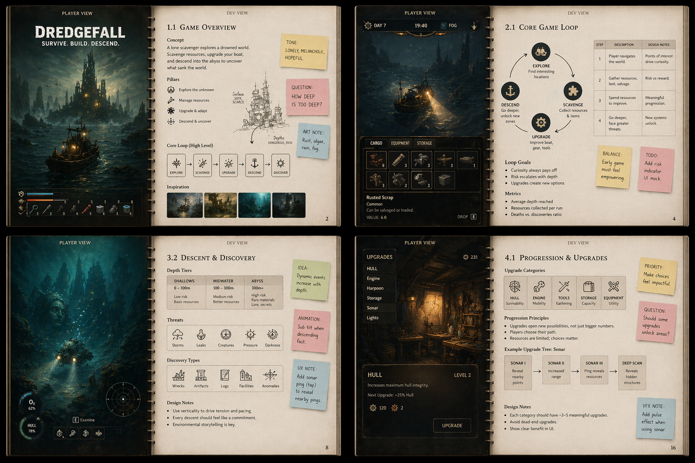
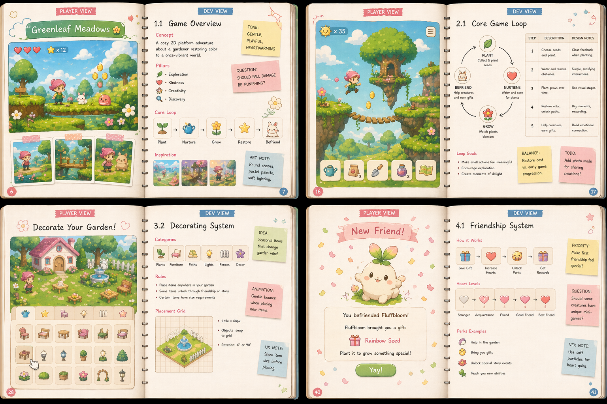
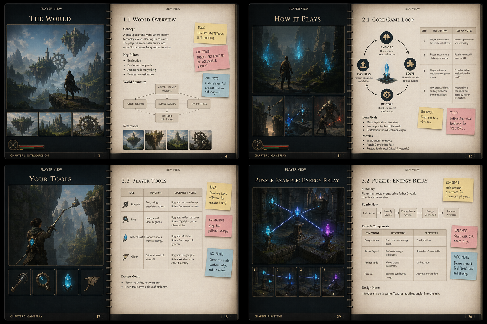
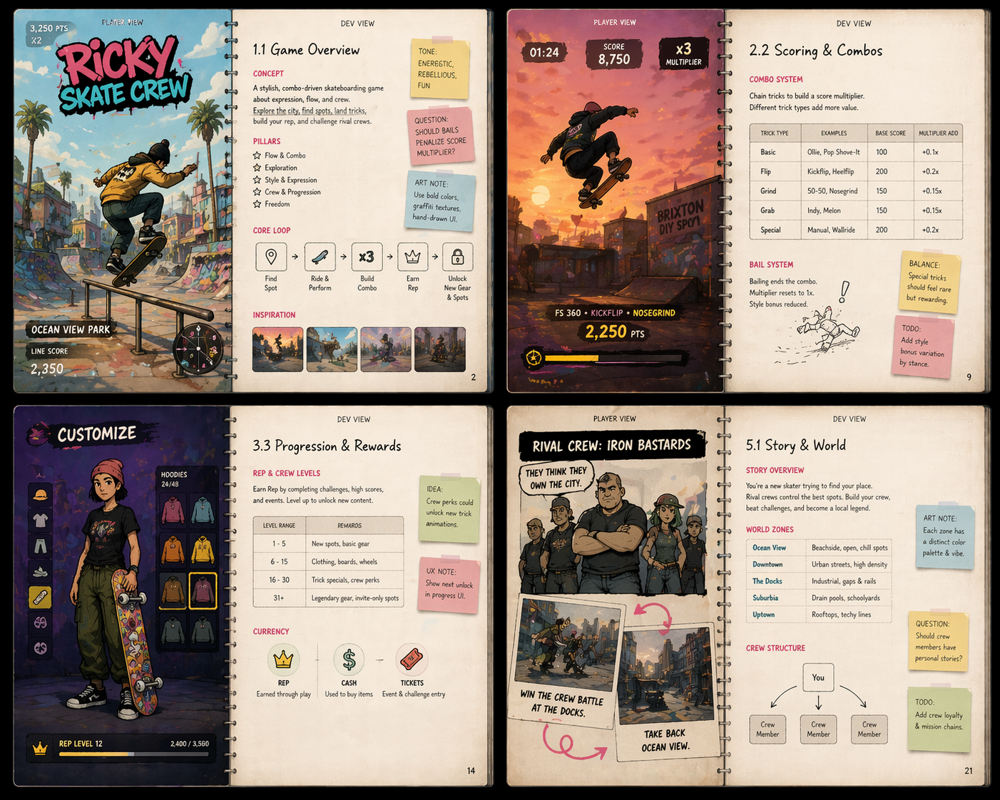

The Gamebook convention
=======================
- The `Gamebook` is an unified document where product, players and whole devteam is reflected in chronological order, *from player's point of view*.

## Contents
1. The Gamebook has no chapters per se, but may have an optional index.
2. First pages cover anything that happens *before the game is run*: marketing, ads, gamecons, reviews, webs, videos, landing pages, websites, press kits, app-store views, kickstarter, trials, purchases, downloads, installation, dependencies, setup, etc...
3. Middle pages cover anything that happens *until game is over*: menus, login, loading screens, tutorials, levels, stages, rewards, bosses, credits, etc...
4. Final pages cover everything that happens *after game is over*: extensions, dlcs, uninstalling, app-store reviews, blog comments, and regular post-activity once game is finished. Everything that makes a player to reinstall and replay the game applies here too.

## Format
1. Every pair of landscape pages features a stage (inside or outside the game) that the player has *to experience* (left page), and also how developers are going *to make it possible* (right page).
2. On every *left page* (player's view) there are images, storyboards, hand-drawn sketches, pictures, screenshots, huds, etc... that explain, in *visual language*, what the player has to do/experience from his/her own point of view. Arrows, bubbles, hand-made annotations, etc are allowed; development flows, charts and diagrams are not.
3. On every *right page* (developer's view) there is all required information for the left page to happen: implementation details, required tech, algorithms and code approaches, artwork directions, upcoming difficulties, routes to take, time estimations, budget constraints, what to do, and not to do, etc etc... Any kind of info is allowed as long as it provides valuable information to the team: richtext, urls, mails, comments, text chats, charts, diagrams, flows, source code, external references, etc...
4. Left page is *unaware*, and it does not care, of what it happens or reads *on the right page*.

## Result
Page after page, we uncover the whole game from a very focused player's point of view, in chronological order, while we explain all marketing-artwork-design-technical hints/constraints we may have during development. The whole book is read in choronological order, exactly as player would experience our game from the very beginning until the end.

## History
- Revision #4 - Minor tweaks. Added IA-generated sample image renditions (Apr/2026)
- Revision #3 - Updated to Python 3 (16/May/19) (@NBurley93)
- Revision #2 - English version (04/Feb/15) (@r-lyeh)
- Revision #1 - Initial commit, Spanish version (03/Nov/14) (@r-lyeh)

## License
- CC0 license :) 
- https://creativecommons.org/about/cc0

## Sample mockups (IA generated)

Here you have a few IA generated samples to get you started:

Have some real pics of your gamebooks? Feel free to share!
